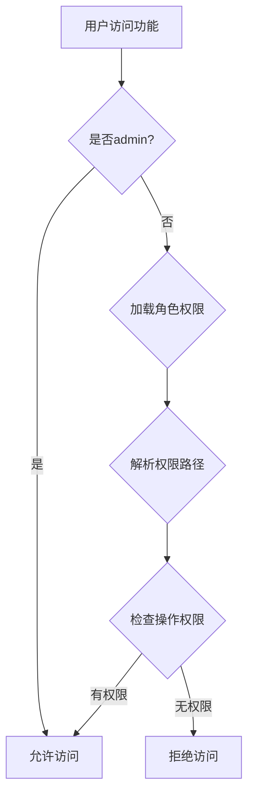

# 权限管理系统技术文档

## 文档版本
- **版本**: v2.2.4
- **最后更新**: 2025-12-16
- **适用系统**: 际华协同办公管理平台

---

## 目录

1. [需求概述](#需求概述)
2. [权限模型设计](#权限模型设计)
3. [技术实现方案](#技术实现方案)
4. [核心功能说明](#核心功能说明)
5. [使用指南](#使用指南)
6. [问题解决记录](#问题解决记录)
7. [API参考](#api参考)

---

## 需求概述

### 业务背景

际华协同办公管理平台需要实现细粒度的权限控制，确保不同角色的用户只能访问和操作其权限范围内的功能和数据。

### 核心需求

#### 1. 功能权限控制
- **模块级权限**: 控制用户能否访问某个功能模块（如任务管理、商机管理等）
- **操作级权限**: 控制用户在模块内的具体操作（查看、创建、编辑、删除、导出等）
- **Tab级权限**: 控制复杂模块内的子功能Tab显示/隐藏（如目标管理的销售目标、团队目标等）

#### 2. 数据权限控制
- **全部数据**: 查看和操作所有数据
- **本部门数据**: 仅查看和操作本部门及下级部门数据
- **本人数据**: 仅查看和操作本人创建的数据

#### 3. 特殊用户处理
- **admin超级用户**:
  - 系统内置账户，不可删除
  - 不在员工列表中显示
  - 默认拥有所有权限（无需配置）
  - 绕过所有权限检查
  
- **普通角色**:
  - 包括"子管理员"在内的所有角色都是普通角色
  - 必须通过角色权限配置来获得权限
  - 受权限系统完全控制

#### 4. 系统设置模块权限化
- 系统设置及其所有子模块都受权限控制
- 子模块包括：员工管理、部门管理、角色权限、类型设置、操作日志
- 每个子模块的增删改查操作都需要对应权限

---

## 权限模型设计

### 数据结构

#### 角色权限对象结构
```typescript
interface RolePermissions {
  // 任务管理
  task: {
    view: boolean;      // 查看
    create: boolean;    // 创建
    edit: boolean;      // 编辑
    delete: boolean;    // 删除
    export: boolean;    // 导出
  };
  
  // 商机管理
  opportunity: {
    view: boolean;
    create: boolean;
    edit: boolean;
    delete: boolean;
    export: boolean;
  };
  
  // 项目管理
  project: {
    view: boolean;
    create: boolean;
    edit: boolean;
    delete: boolean;
    export: boolean;
  };
  
  // 目标管理（嵌套权限）
  goal: {
    salesGoal: {       // 销售目标
      view: boolean;
      create: boolean;
      edit: boolean;
      delete: boolean;
    };
    teamGoal: {        // 团队目标
      view: boolean;
      create: boolean;
      edit: boolean;
      delete: boolean;
    };
    performanceGoal: { // 绩效目标
      view: boolean;
      create: boolean;
      edit: boolean;
      delete: boolean;
    };
    goalReport: {      // 目标报表
      view: boolean;
      export: boolean;
    };
  };
  
  // 系统设置（嵌套权限）
  settings: {
    userApproval: {    // 待审核用户
      view: boolean;
      approve: boolean;
    };
    employees: {       // 员工管理
      view: boolean;
      create: boolean;
      edit: boolean;
      delete: boolean;
    };
    departments: {     // 部门管理
      view: boolean;
      create: boolean;
      edit: boolean;
      delete: boolean;
    };
    roles: {          // 角色权限
      view: boolean;
      create: boolean;
      edit: boolean;
      delete: boolean;
    };
    types: {          // 类型设置
      view: boolean;
      create: boolean;
      edit: boolean;
      delete: boolean;
    };
    operationLogs: {  // 操作日志
      view: boolean;
      export: boolean;
      delete: boolean;
    };
  };
}
```

#### 用户数据权限
```typescript
type DataPermission = 'all' | 'department' | 'own';

interface UserDataPermissions {
  task: DataPermission;
  opportunity: DataPermission;
  project: DataPermission;
  goal: DataPermission;
}
```

### 权限继承规则

1. **功能权限**: 用户通过角色获得功能权限
2. **数据权限**: 独立于功能权限，控制数据范围
3. **admin特权**: admin用户绕过所有权限检查，拥有完全访问权

---

## 技术实现方案

### 核心组件

#### 1. 权限上下文 (PermissionContext)

**文件**: `contexts/PermissionContext.tsx`

```typescript
const PermissionContext = createContext<PermissionContextType | undefined>(undefined);

export const PermissionProvider: React.FC<{ children: React.ReactNode }> = ({ children }) => {
  const { currentUser } = useAuth();
  const [permissions, setPermissions] = useState<RolePermissions | null>(null);
  const [dataPermissions, setDataPermissions] = useState<UserDataPermissions | null>(null);

  useEffect(() => {
    if (currentUser) {
      loadPermissions(currentUser);
    }
  }, [currentUser]);

  // ... 实现细节
};
```

**职责**:
- 加载用户权限配置
- 提供权限检查方法
- 缓存权限数据

#### 2. 权限工具函数

**文件**: `utils/permissionUtils.ts`

##### `hasPermission` - 嵌套路径权限检查

```typescript
export const hasPermission = (
  permissions: RolePermissions | null,
  module: string,
  action: string
): boolean => {
  if (!permissions) return false;

  // 支持嵌套路径：'goal.salesGoal' -> goal -> salesGoal
  const modulePath = module.split('.');
  let modulePerms: any = permissions;

  // 逐级遍历权限对象
  for (const key of modulePath) {
    if (!modulePerms || typeof modulePerms !== 'object') {
      return false;
    }
    modulePerms = modulePerms[key];
  }

  // 检查最终权限
  if (!modulePerms || typeof modulePerms !== 'object') {
    return false;
  }

  return modulePerms[action] === true;
};
```

**支持的路径格式**:
- 简单路径: `'task'`, `'opportunity'`
- 嵌套路径: `'goal.salesGoal'`, `'settings.employees'`

##### `hasDataPermission` - 数据权限检查

```typescript
export const hasDataPermission = (
  dataPermissions: UserDataPermissions | null,
  module: keyof UserDataPermissions,
  permission: DataPermission
): boolean => {
  if (!dataPermissions) return false;
  return dataPermissions[module] === permission;
};
```

##### `checkPermission` - React组件权限包装

```typescript
export const checkPermission = (
  module: string,
  action: string,
  userRole?: string,
  permissions?: RolePermissions | null
): boolean => {
  // admin超级用户绕过检查
  if (userRole === 'admin') return true;
  
  if (!permissions) return false;
  return hasPermission(permissions, module, action);
};
```

#### 3. 权限Hook

**文件**: `hooks/usePermission.ts`

```typescript
export const usePermission = () => {
  const context = useContext(PermissionContext);
  
  if (!context) {
    throw new Error('usePermission must be used within PermissionProvider');
  }
  
  return context;
};
```

### UI层权限控制实现

#### 1. 侧边栏菜单控制

**文件**: `components/Sidebar.tsx`

```typescript
const menuItems = [
  { id: 'dashboard', label: '工作台', icon: LayoutDashboard },
  
  // 有任务权限才显示
  ...(userRole === 'admin' || checkPermission('task', 'view')
    ? [{ id: 'tasks', label: '任务管理', icon: CheckSquare }]
    : []
  ),
  
  // 有商机权限才显示
  ...(userRole === 'admin' || checkPermission('opportunity', 'view')
    ? [{ id: 'opportunities', label: '商机管理', icon: TrendingUp }]
    : []
  ),
  
  // 系统设置：admin或有任一子模块查看权限
  ...(userRole === 'admin' || 
      checkPermission('settings.userApproval', 'view') ||
      checkPermission('settings.employees', 'view') ||
      checkPermission('settings.departments', 'view') ||
      checkPermission('settings.roles', 'view') ||
      checkPermission('settings.types', 'view') ||
      checkPermission('settings.operationLogs', 'view')
    ? [{ id: 'settings', label: '系统设置', icon: Settings }]
    : []
  ),
];
```

#### 2. Tab级别权限控制

**文件**: `components/pages/GoalManagement.tsx`

```typescript
const GoalManagement = () => {
  const [activeTab, setActiveTab] = useState('salesGoal');
  const { checkPermission, userRole } = usePermissionContext();

  // 自动选择第一个有权限的Tab
  useEffect(() => {
    const tabs = ['salesGoal', 'teamGoal', 'performanceGoal', 'goalReport'];
    const firstAvailableTab = tabs.find(tab => 
      userRole === 'admin' || checkPermission(`goal.${tab}`, 'view')
    );
    
    if (firstAvailableTab) {
      setActiveTab(firstAvailableTab);
    }
  }, [userRole, checkPermission]);

  return (
    <div className="space-y-6">
      <div className="flex items-center justify-between">
        <h1 className="text-2xl font-bold text-gray-900">目标管理</h1>
      </div>

      <div className="bg-white shadow rounded-lg">
        <div className="border-b border-gray-200">
          <nav className="flex -mb-px">
            {/* 销售目标Tab - 需要查看权限 */}
            {(userRole === 'admin' || checkPermission('goal.salesGoal', 'view')) && (
              <button
                onClick={() => setActiveTab('salesGoal')}
                className={`py-4 px-6 ${activeTab === 'salesGoal' ? '...' : '...'}`}
              >
                销售目标
              </button>
            )}
            
            {/* 其他Tab类似... */}
          </nav>
        </div>
        
        {/* Tab内容 */}
      </div>
    </div>
  );
};
```

#### 3. 操作按钮权限控制

**文件**: `components/pages/SystemSettings.tsx`

```typescript
// 员工管理 - 添加员工按钮
{(userRole === 'admin' || checkPermission('settings.employees', 'create')) && (
  <button onClick={handleAddUser} className="...">
    <Plus className="h-4 w-4 mr-2" />
    添加员工
  </button>
)}

// 员工管理 - 回收站按钮
{(userRole === 'admin' || checkPermission('settings.employees', 'delete')) && (
  <button onClick={() => setShowDeletedUsers(true)} className="...">
    <Trash2 className="h-4 w-4 mr-2" />
    回收站
  </button>
)}

// 员工列表 - 编辑按钮
{(userRole === 'admin' || checkPermission('settings.employees', 'edit')) && (
  <button onClick={() => handleEditUser(user)} className="...">
    <Edit className="h-3 w-3" />
  </button>
)}

// 员工列表 - 删除按钮
{(userRole === 'admin' || checkPermission('settings.employees', 'delete')) && (
  <button onClick={() => handleDeleteUser(user._id)} className="...">
    <Trash2 className="h-3 w-3" />
  </button>
)}
```

#### 4. admin用户特殊处理

**文件**: `components/pages/SystemSettings.tsx`

##### 员工列表过滤
```typescript
// 过滤掉admin用户和已删除用户
const filteredUsers = users.filter(user => 
  user.deleted !== true && 
  user.username !== 'admin'
);
```

##### 删除保护
```typescript
const handleDeleteUser = async (userId: string) => {
  const userToDelete = users.find(u => u._id === userId);
  
  // 不允许删除admin用户
  if (userToDelete?.username === 'admin' || userToDelete?.role === 'admin') {
    alert('不允许删除管理员账户');
    return;
  }
  
  // ... 删除逻辑
};
```

---

## 核心功能说明

### 1. 功能权限检查流程



### 2. 嵌套权限路径解析

**示例**: 检查 `'goal.salesGoal'` 的 `'view'` 权限

```typescript
// 输入
module = 'goal.salesGoal'
action = 'view'
permissions = {
  goal: {
    salesGoal: {
      view: true,
      create: false,
      ...
    }
  }
}

// 处理过程
modulePath = ['goal', 'salesGoal']  // 分割路径
modulePerms = permissions           // 起点

// 第一次循环: key = 'goal'
modulePerms = permissions['goal']   // 进入goal对象

// 第二次循环: key = 'salesGoal'
modulePerms = modulePerms['salesGoal']  // 进入salesGoal对象

// 检查最终权限
result = modulePerms['view']  // true
```

### 3. Tab自动选择逻辑

```typescript
useEffect(() => {
  const tabs = ['salesGoal', 'teamGoal', 'performanceGoal', 'goalReport'];
  
  // 找到第一个有查看权限的Tab
  const firstAvailableTab = tabs.find(tab => 
    userRole === 'admin' || 
    checkPermission(`goal.${tab}`, 'view')
  );
  
  if (firstAvailableTab) {
    setActiveTab(firstAvailableTab);
  }
}, [userRole, checkPermission]);
```

**逻辑**:
1. 组件加载或权限变化时触发
2. 遍历所有Tab，检查权限
3. 自动激活第一个有权限的Tab
4. 如果当前Tab无权限，用户将看不到该Tab

---

## 使用指南

### 管理员操作指南

#### 1. 创建角色并配置权限

1. 进入 **系统设置 > 角色权限**
2. 点击 **新增角色**
3. 填写角色信息:
   - 角色名称
   - 角色描述
4. 配置功能权限:
   - 勾选允许的模块和操作
   - 嵌套模块（如目标管理）可单独配置子功能
5. 保存角色

#### 2. 分配用户角色

1. 进入 **系统设置 > 员工管理**
2. 编辑目标用户
3. 在 **角色** 下拉框中选择角色
4. 保存

#### 3. 配置数据权限

1. 进入 **系统设置 > 员工管理**
2. 编辑目标用户
3. 设置各模块的数据权限:
   - **全部数据**: 查看和操作所有数据
   - **本部门数据**: 仅本部门及下级部门
   - **本人数据**: 仅本人创建的数据
4. 保存

### 开发者集成指南

#### 1. 在新页面中使用权限

```typescript
import { usePermissionContext } from '../contexts/PermissionContext';

const MyPage = () => {
  const { checkPermission, userRole } = usePermissionContext();

  return (
    <div>
      {/* 检查查看权限 */}
      {(userRole === 'admin' || checkPermission('myModule', 'view')) && (
        <div>页面内容</div>
      )}
      
      {/* 检查创建权限 */}
      {(userRole === 'admin' || checkPermission('myModule', 'create')) && (
        <button>创建</button>
      )}
    </div>
  );
};
```

#### 2. 添加嵌套模块权限

**步骤1**: 在 `types/permission.ts` 中定义权限结构

```typescript
export interface RolePermissions {
  // ... 现有权限
  
  myModule: {
    subModule1: {
      view: boolean;
      create: boolean;
      edit: boolean;
      delete: boolean;
    };
    subModule2: {
      view: boolean;
      export: boolean;
    };
  };
}
```

**步骤2**: 在组件中使用

```typescript
// 检查子模块权限
{checkPermission('myModule.subModule1', 'view') && (
  <div>子模块1内容</div>
)}

{checkPermission('myModule.subModule2', 'export') && (
  <button>导出</button>
)}
```

#### 3. 实现Tab自动选择

```typescript
const [activeTab, setActiveTab] = useState('defaultTab');
const { checkPermission, userRole } = usePermissionContext();

useEffect(() => {
  const tabs = ['tab1', 'tab2', 'tab3'];
  const firstAvailable = tabs.find(tab => 
    userRole === 'admin' || 
    checkPermission(`myModule.${tab}`, 'view')
  );
  
  if (firstAvailable) {
    setActiveTab(firstAvailable);
  }
}, [userRole, checkPermission]);
```

---

## 问题解决记录

### 问题1: 嵌套权限路径不支持

**现象**: `checkPermission('goal.salesGoal', 'view')` 返回 false

**原因**: 原 `hasPermission` 函数只支持一级路径，无法处理点号分隔的嵌套路径

**解决方案**: 
- 修改 `hasPermission` 函数
- 使用 `split('.')` 分割路径
- 逐级遍历权限对象

**代码**:
```typescript
const modulePath = module.split('.');
let modulePerms: any = permissions;

for (const key of modulePath) {
  if (!modulePerms || typeof modulePerms !== 'object') {
    return false;
  }
  modulePerms = modulePerms[key];
}
```

**提交**: v2.2.2

---

### 问题2: 无权限Tab仍然显示

**现象**: 用户没有"商机目标"权限，但Tab仍然可见

**原因**: Tab按钮未添加权限检查，所有Tab都会渲染

**解决方案**:
- 为每个Tab按钮添加 `checkPermission` 包裹
- 使用条件渲染，无权限则不显示Tab

**代码**:
```typescript
{(userRole === 'admin' || checkPermission('goal.salesGoal', 'view')) && (
  <button onClick={() => setActiveTab('salesGoal')}>
    销售目标
  </button>
)}
```

**提交**: v2.2.3

---

### 问题3: Tab自动选择到无权限Tab

**现象**: 组件加载后默认显示第一个Tab，但用户可能无权限

**原因**: 没有根据权限自动选择Tab，使用了硬编码的默认值

**解决方案**:
- 添加 `useEffect` Hook
- 遍历Tab列表，找到第一个有权限的Tab
- 自动设置为激活Tab

**代码**:
```typescript
useEffect(() => {
  const tabs = ['salesGoal', 'teamGoal', 'performanceGoal', 'goalReport'];
  const firstAvailableTab = tabs.find(tab => 
    userRole === 'admin' || checkPermission(`goal.${tab}`, 'view')
  );
  
  if (firstAvailableTab) {
    setActiveTab(firstAvailableTab);
  }
}, [userRole, checkPermission]);
```

**提交**: v2.2.3

---

### 问题4: 系统设置子模块操作无权限控制

**现象**: 所有用户都能看到添加、编辑、删除等操作按钮

**原因**: 操作按钮未添加权限检查

**解决方案**:
- 为每个操作按钮添加对应的权限检查
- 包括：创建、编辑、删除、导出、审批等操作

**代码示例**:
```typescript
// 添加按钮 - 需要create权限
{(userRole === 'admin' || checkPermission('settings.employees', 'create')) && (
  <button onClick={handleAdd}>添加</button>
)}

// 编辑按钮 - 需要edit权限
{(userRole === 'admin' || checkPermission('settings.employees', 'edit')) && (
  <button onClick={handleEdit}>编辑</button>
)}

// 删除按钮 - 需要delete权限
{(userRole === 'admin' || checkPermission('settings.employees', 'delete')) && (
  <button onClick={handleDelete}>删除</button>
)}
```

**涉及模块**:
- 员工管理: 添加、编辑、删除、回收站
- 部门管理: 添加、编辑、删除
- 角色权限: 新增、编辑、删除
- 类型设置: 所有增删改操作
- 操作日志: 导出、清空

**提交**: v2.2.4

---

### 问题5: admin用户在列表中显示

**现象**: admin账户出现在员工列表中

**原因**: 列表查询未过滤admin用户

**解决方案**:
- 在员工列表渲染前过滤掉 `username === 'admin'` 的用户
- 在删除操作中添加保护，禁止删除admin账户

**代码**:
```typescript
// 列表过滤
const filteredUsers = users.filter(user => 
  user.deleted !== true && 
  user.username !== 'admin'
);

// 删除保护
if (userToDelete?.username === 'admin' || userToDelete?.role === 'admin') {
  alert('不允许删除管理员账户');
  return;
}
```

**提交**: v2.2.4

---

## API参考

### 权限检查函数

#### `hasPermission(permissions, module, action)`

检查是否具有指定模块和操作的权限。

**参数**:
- `permissions` (RolePermissions | null): 权限对象
- `module` (string): 模块路径，支持嵌套（如 'goal.salesGoal'）
- `action` (string): 操作类型（'view', 'create', 'edit', 'delete', 'export'等）

**返回**: boolean

**示例**:
```typescript
// 简单路径
hasPermission(permissions, 'task', 'view')

// 嵌套路径
hasPermission(permissions, 'goal.salesGoal', 'create')
hasPermission(permissions, 'settings.employees', 'delete')
```

---

#### `checkPermission(module, action, userRole?, permissions?)`

React组件中使用的权限检查，自动处理admin特权。

**参数**:
- `module` (string): 模块路径
- `action` (string): 操作类型
- `userRole` (string, optional): 用户角色
- `permissions` (RolePermissions | null, optional): 权限对象

**返回**: boolean

**特性**:
- admin用户自动返回 true
- 其他用户调用 `hasPermission` 检查

**示例**:
```typescript
// 在组件中使用
const { checkPermission, userRole } = usePermissionContext();

checkPermission('task', 'view')
checkPermission('goal.teamGoal', 'edit')
```

---

#### `hasDataPermission(dataPermissions, module, permission)`

检查数据权限。

**参数**:
- `dataPermissions` (UserDataPermissions | null): 数据权限对象
- `module` (keyof UserDataPermissions): 模块名
- `permission` (DataPermission): 权限级别（'all', 'department', 'own'）

**返回**: boolean

**示例**:
```typescript
// 检查是否有查看所有任务的权限
hasDataPermission(dataPermissions, 'task', 'all')

// 检查是否只能查看本部门商机
hasDataPermission(dataPermissions, 'opportunity', 'department')
```

---

### React Hooks

#### `usePermissionContext()`

获取权限上下文。

**返回**:
```typescript
{
  permissions: RolePermissions | null;
  dataPermissions: UserDataPermissions | null;
  checkPermission: (module: string, action: string) => boolean;
  userRole: string;
  hasModuleAccess: (module: string) => boolean;
}
```

**示例**:
```typescript
const MyComponent = () => {
  const { 
    checkPermission, 
    userRole, 
    hasModuleAccess 
  } = usePermissionContext();
  
  // 使用权限检查
  if (!hasModuleAccess('task')) {
    return <div>无权访问</div>;
  }
  
  return (
    <div>
      {checkPermission('task', 'create') && (
        <button>创建任务</button>
      )}
    </div>
  );
};
```

---

### 权限类型定义

#### 操作类型 (Action)
```typescript
type Action = 
  | 'view'      // 查看
  | 'create'    // 创建
  | 'edit'      // 编辑
  | 'delete'    // 删除
  | 'export'    // 导出
  | 'approve';  // 审批
```

#### 数据权限类型
```typescript
type DataPermission = 
  | 'all'         // 全部数据
  | 'department'  // 本部门数据
  | 'own';        // 本人数据
```

---

## 最佳实践

### 1. 权限检查的层次

```typescript
// 第一层：菜单显示控制（Sidebar）
...(userRole === 'admin' || checkPermission('task', 'view')
  ? [{ id: 'tasks', label: '任务管理', icon: CheckSquare }]
  : []
)

// 第二层：页面访问控制
if (!hasModuleAccess('task')) {
  return <Navigate to="/dashboard" />;
}

// 第三层：Tab显示控制
{checkPermission('goal.salesGoal', 'view') && (
  <TabButton>销售目标</TabButton>
)}

// 第四层：操作按钮控制
{checkPermission('task', 'create') && (
  <button>创建任务</button>
)}
```

### 2. admin用户处理

**统一模式**:
```typescript
// 所有权限检查都优先检查admin
if (userRole === 'admin') return true;

// 或使用checkPermission自动处理
{(userRole === 'admin' || checkPermission('module', 'action')) && (
  <Component />
)}
```

### 3. 嵌套权限命名规范

**模块.子模块.操作**:
- `goal.salesGoal.view`
- `settings.employees.create`
- `opportunity.follow.edit`

**优势**:
- 清晰的层次结构
- 便于管理和理解
- 支持灵活的权限粒度

### 4. 防御性编程

**始终检查null**:
```typescript
if (!permissions) return false;
if (!modulePerms || typeof modulePerms !== 'object') return false;
```

**提供降级方案**:
```typescript
const firstAvailableTab = tabs.find(tab => checkPermission(tab)) || 'default';
```

---

## 附录

### 权限配置示例

#### 示例1: 普通销售人员
```json
{
  "task": {
    "view": true,
    "create": true,
    "edit": true,
    "delete": false,
    "export": false
  },
  "opportunity": {
    "view": true,
    "create": true,
    "edit": true,
    "delete": false,
    "export": false
  },
  "goal": {
    "salesGoal": {
      "view": true,
      "create": false,
      "edit": false,
      "delete": false
    }
  },
  "settings": {
    // 无系统设置权限
  }
}
```

**数据权限**:
- 任务: 本人数据
- 商机: 本人数据
- 目标: 本人数据

---

#### 示例2: 部门经理
```json
{
  "task": {
    "view": true,
    "create": true,
    "edit": true,
    "delete": true,
    "export": true
  },
  "opportunity": {
    "view": true,
    "create": true,
    "edit": true,
    "delete": true,
    "export": true
  },
  "goal": {
    "salesGoal": {
      "view": true,
      "create": true,
      "edit": true,
      "delete": false
    },
    "teamGoal": {
      "view": true,
      "create": true,
      "edit": true,
      "delete": true
    }
  },
  "settings": {
    "employees": {
      "view": true,
      "create": false,
      "edit": true,
      "delete": false
    }
  }
}
```

**数据权限**:
- 任务: 本部门数据
- 商机: 本部门数据
- 目标: 本部门数据

---

#### 示例3: 子管理员（普通角色）
```json
{
  "task": {
    "view": true,
    "create": true,
    "edit": true,
    "delete": true,
    "export": true
  },
  "opportunity": {
    "view": true,
    "create": true,
    "edit": true,
    "delete": true,
    "export": true
  },
  "project": {
    "view": true,
    "create": true,
    "edit": true,
    "delete": true,
    "export": true
  },
  "goal": {
    "salesGoal": {
      "view": true,
      "create": true,
      "edit": true,
      "delete": true
    },
    "teamGoal": {
      "view": true,
      "create": true,
      "edit": true,
      "delete": true
    },
    "performanceGoal": {
      "view": true,
      "create": true,
      "edit": true,
      "delete": true
    }
  },
  "settings": {
    "employees": {
      "view": true,
      "create": true,
      "edit": true,
      "delete": true
    },
    "departments": {
      "view": true,
      "create": true,
      "edit": true,
      "delete": true
    },
    "roles": {
      "view": true,
      "create": false,  // 不能创建角色
      "edit": false,
      "delete": false
    }
  }
}
```

**数据权限**:
- 所有模块: 全部数据

**注意**: 子管理员是普通角色，没有特殊性，所有权限都需要明确配置。

---

### 版本历史

| 版本 | 日期 | 修改内容 |
|------|------|----------|
| v2.2.4 | 2025-12-16 | 系统设置子模块操作权限控制 |
| v2.2.3 | 2025-12-16 | Tab级别权限显示控制 + 自动选择 |
| v2.2.2 | 2025-12-16 | 嵌套权限路径支持 |
| v2.2.1 | 2025-12-15 | 用户角色和职务显示修复 |
| v2.2.0 | 2025-12-15 | admin超级用户特殊处理 + 子管理员去特权化 |
| v2.1.0 | 2025-12-14 | 权限系统基础框架 |

---

**文档维护者**: AI Development Team  
**最后审核**: 2025-12-16
