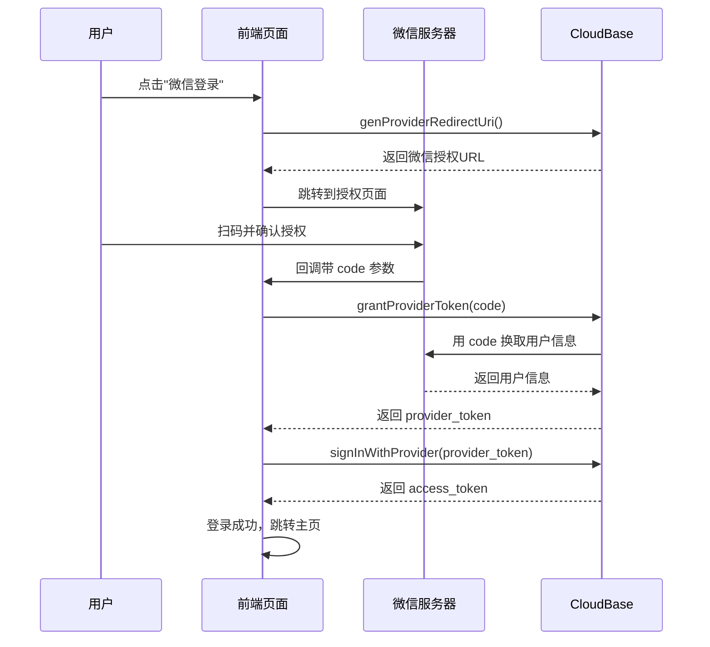

# 微信扫码登录完整实现方案

## 📋 方案概述

**技术栈**：CloudBase Web SDK + 微信开放平台 OAuth 2.0

**实现流程**：
```
用户点击"微信登录" 
   ↓
生成微信授权URL并跳转
   ↓
用户扫码授权
   ↓
微信回调到前端 callback 页面
   ↓
用 code 换取 provider_token
   ↓
用 provider_token 完成 CloudBase 登录
   ↓
登录成功，跳转到应用主页
```

---

## 🚀 实施步骤

### 第一步：微信开放平台准备（必做）

#### 1.1 注册微信开放平台账号
- 访问：https://open.weixin.qq.com/cgi-bin/readtemplate?t=regist/regist_tmpl
- 注册并创建网站应用

#### 1.2 获取 AppID 和 AppSecret
- 进入开发者后台
- 创建网站应用
- 获取：
  - `AppID`（客户端ID）
  - `AppSecret`（客户端密钥）

#### 1.3 配置授权回调域名
在微信开放平台配置授权回调域名：
```
parasaga-5g6ibiua4b9422eb-1301818329.tcloudbaseapp.com
```

⚠️ **注意**：必须是域名，不能是 IP 地址或带端口号

---

### 第二步：CloudBase 控制台配置（必做）

#### 2.1 开启微信开放平台登录
1. 访问控制台：
   ```
   https://tcb.cloud.tencent.com/dev?envId=parasaga-5g6ibiua4b9422eb#/identity/login-manage
   ```

2. 找到"微信开放平台登录"并点击"配置"

3. 填入微信开放平台的信息：
   - **AppID**：从微信开放平台获取
   - **AppSecret**：从微信开放平台获取

4. 点击"保存"

#### 2.2 配置安全域名
1. 在控制台进入"身份认证" → "安全域名"
2. 添加以下域名：
   ```
   parasaga-5g6ibiua4b9422eb-1301818329.tcloudbaseapp.com
   localhost:5173  // 本地开发环境（可选）
   ```

---

### 第三步：前端代码实现

#### 3.1 创建微信登录按钮组件

已创建文件：`components/WeChatLogin.tsx`

**功能**：
- ✅ 生成微信授权地址
- ✅ 跳转到微信扫码页面
- ✅ 加载状态显示

**使用方法**：
```tsx
import WeChatLogin from './components/WeChatLogin';

<WeChatLogin
  onSuccess={() => console.log('登录成功')}
  onError={(error) => console.error('登录失败', error)}
/>
```

#### 3.2 创建微信回调处理页面

已创建文件：`components/WeChatCallback.tsx`

**功能**：
- ✅ 接收微信回调参数（code）
- ✅ 用 code 换取 provider_token
- ✅ 用 provider_token 完成 CloudBase 登录
- ✅ 显示登录状态（加载中/成功/失败）
- ✅ 自动跳转到主页

#### 3.3 配置路由

需要在 `App.tsx` 中添加微信回调路由：

```tsx
import WeChatCallback from './components/WeChatCallback';

// 在路由配置中添加
<Route path="/wechat-callback" element={<WeChatCallback />} />
```

#### 3.4 在登录页中集成微信登录按钮

在 `LoginPage.tsx` 中添加：

```tsx
import WeChatLogin from './WeChatLogin';

// 在登录表单下方添加
<div className="mt-6">
  <div className="relative">
    <div className="absolute inset-0 flex items-center">
      <div className="w-full border-t border-gray-300"></div>
    </div>
    <div className="relative flex justify-center text-sm">
      <span className="px-2 bg-white text-gray-500">或</span>
    </div>
  </div>
  
  <div className="mt-6">
    <WeChatLogin
      onSuccess={() => {
        // 登录成功后的处理
      }}
      onError={(error) => {
        setError('微信登录失败，请重试');
      }}
    />
  </div>
</div>
```

---

## 🔧 技术实现细节

### CloudBase Web SDK API 使用

#### 1. 生成微信授权地址
```typescript
const auth = app.auth();

const { uri } = await auth.genProviderRedirectUri({
  provider_id: 'wx_open',                    // 微信开放平台固定值
  provider_redirect_uri: `${window.location.origin}/wechat-callback`,  // 回调地址
  state: `wechat_login_${Date.now()}`,       // 防CSRF攻击参数
});

window.location.href = uri;  // 跳转到微信授权页面
```

#### 2. 用 code 换取 provider_token
```typescript
const urlParams = new URLSearchParams(window.location.search);
const provider_code = urlParams.get('code');

const { provider_token } = await auth.grantProviderToken({
  provider_id: 'wx_open',
  provider_redirect_uri: window.location.href,  // 当前完整URL
  provider_code,
});
```

#### 3. 用 provider_token 登录
```typescript
await auth.signInWithProvider({ provider_token });

// 获取当前用户
const user = await auth.getCurrentUser();
console.log('用户信息:', user);
```

---

## 📝 完整登录流程说明

### 用户操作流程

1. **用户访问登录页**
   - 显示"微信扫码登录"按钮

2. **点击微信登录按钮**
   - 前端调用 `genProviderRedirectUri` 生成授权URL
   - 自动跳转到微信授权页面

3. **微信扫码授权**
   - 用户使用微信扫描二维码
   - 用户确认授权

4. **微信回调**
   - 微信跳转到：`https://your-domain.com/wechat-callback?code=xxx&state=xxx`

5. **前端处理回调**
   - 从 URL 获取 `code` 参数
   - 调用 `grantProviderToken` 换取 `provider_token`
   - 调用 `signInWithProvider` 完成登录

6. **登录成功**
   - 获取用户信息
   - 跳转到主页

### 技术流程（详细）



---

## ⚠️ 常见问题和解决方案

### Q1: 点击微信登录后无反应？

**可能原因**：
- CloudBase 环境 ID 配置错误
- 微信开放平台 AppID/AppSecret 未配置

**解决方法**：
1. 检查 `lib/cloudbase.ts` 中的环境 ID
2. 检查 CloudBase 控制台微信登录配置

### Q2: 微信授权后回调失败？

**可能原因**：
- 授权回调域名未配置
- 回调地址 URL 不正确

**解决方法**：
1. 在微信开放平台配置正确的回调域名
2. 确保回调 URL 与配置的域名一致

### Q3: 提示"安全域名验证失败"？

**可能原因**：
- CloudBase 控制台未配置安全域名

**解决方法**：
1. 进入 CloudBase 控制台
2. 添加前端域名到"安全域名"列表

### Q4: 本地开发环境无法测试微信登录？

**原因**：
- 微信不支持 `localhost` 回调

**解决方法 1**（推荐）：
- 使用内网穿透工具（如 ngrok）
- 将本地服务映射到公网域名

**解决方法 2**：
- 直接部署到 CloudBase 静态托管测试

### Q5: 登录成功但用户信息不完整？

**可能原因**：
- 微信用户首次登录，CloudBase 未完整同步用户信息

**解决方法**：
```typescript
// 登录成功后，手动更新用户信息
const user = await auth.getCurrentUser();

if (user && (!user.name || !user.picture)) {
  await user.update({
    name: '微信用户',  // 可以从微信获取昵称
    picture: '头像URL',  // 可以从微信获取头像
  });
}
```

---

## 🎯 测试清单

### 开发环境测试

- [ ] 点击"微信登录"按钮能正常跳转到微信授权页面
- [ ] 扫码授权后能正常回调到前端
- [ ] 回调页面能正确处理 code 参数
- [ ] 能成功换取 provider_token
- [ ] 能成功完成 CloudBase 登录
- [ ] 登录成功后能跳转到主页
- [ ] 能正常获取用户信息

### 生产环境测试

- [ ] HTTPS 证书正常
- [ ] 授权回调域名配置正确
- [ ] 安全域名配置正确
- [ ] 用户首次登录流程正常
- [ ] 用户重复登录流程正常
- [ ] 错误提示友好

---

## 📊 安全性考虑

### CSRF 防护

使用 `state` 参数防止 CSRF 攻击：

```typescript
const state = `wechat_login_${Date.now()}_${Math.random().toString(36).substring(7)}`;

// 生成授权URL时传入
const { uri } = await auth.genProviderRedirectUri({
  provider_id: 'wx_open',
  provider_redirect_uri: `${window.location.origin}/wechat-callback`,
  state,  // 防CSRF参数
});

// 保存 state 到 sessionStorage
sessionStorage.setItem('wechat_login_state', state);

// 回调页面验证 state
const urlParams = new URLSearchParams(window.location.search);
const returnedState = urlParams.get('state');
const savedState = sessionStorage.getItem('wechat_login_state');

if (returnedState !== savedState) {
  throw new Error('State 参数验证失败，可能存在 CSRF 攻击');
}
```

### Token 安全

- ✅ `provider_token` 只在前端临时使用，用完即丢弃
- ✅ CloudBase `access_token` 自动加密存储在 localStorage
- ✅ 所有通信使用 HTTPS

---

## 📦 部署清单

### 部署前检查

- [ ] 微信开放平台应用已创建并审核通过
- [ ] AppID 和 AppSecret 已正确配置到 CloudBase
- [ ] 授权回调域名已配置到微信开放平台
- [ ] 安全域名已配置到 CloudBase 控制台
- [ ] 前端代码已测试通过
- [ ] 路由配置正确

### 部署步骤

1. **构建前端项目**
   ```bash
   npm run build
   ```

2. **部署到 CloudBase 静态托管**
   ```bash
   # 使用 CloudBase CLI 部署
   tcb hosting deploy dist -e parasaga-5g6ibiua4b9422eb
   ```

3. **验证部署**
   - 访问：`https://parasaga-5g6ibiua4b9422eb-1301818329.tcloudbaseapp.com`
   - 测试微信登录流程

---

## 🎓 参考资料

### CloudBase 文档
- [CloudBase 身份认证](https://docs.cloudbase.net/authentication/introduction.html)
- [CloudBase Web SDK](https://docs.cloudbase.net/api-reference/webv2/authentication.html)
- [第三方登录](https://docs.cloudbase.net/authentication/third-party.html)

### 微信开放平台文档
- [网站应用微信登录开发指南](https://developers.weixin.qq.com/doc/oplatform/Website_App/WeChat_Login/Wechat_Login.html)
- [OAuth 2.0 授权流程](https://developers.weixin.qq.com/doc/oplatform/Website_App/WeChat_Login/Authorized_Interface_Calling_UnionID.html)

---

## ✅ 总结

### 优势
- ✅ **无需后端**：完全由前端 + CloudBase 实现
- ✅ **安全可靠**：使用 OAuth 2.0 标准流程
- ✅ **用户体验好**：扫码即可登录，无需记密码
- ✅ **易于维护**：代码简洁，逻辑清晰

### 注意事项
- ⚠️ 必须先在微信开放平台和 CloudBase 控制台完成配置
- ⚠️ 回调域名必须与配置的域名完全一致
- ⚠️ 本地开发需要使用内网穿透或直接部署测试
- ⚠️ 首次使用需要用户扫码授权

---

## 📞 技术支持

如有问题，请联系：
- CloudBase 技术支持：https://cloud.tencent.com/act/event/cloudbase
- 微信开放平台：https://open.weixin.qq.com/

---

**版本**: v1.0  
**创建时间**: 2025-12-30  
**创建人**: AI Assistant
