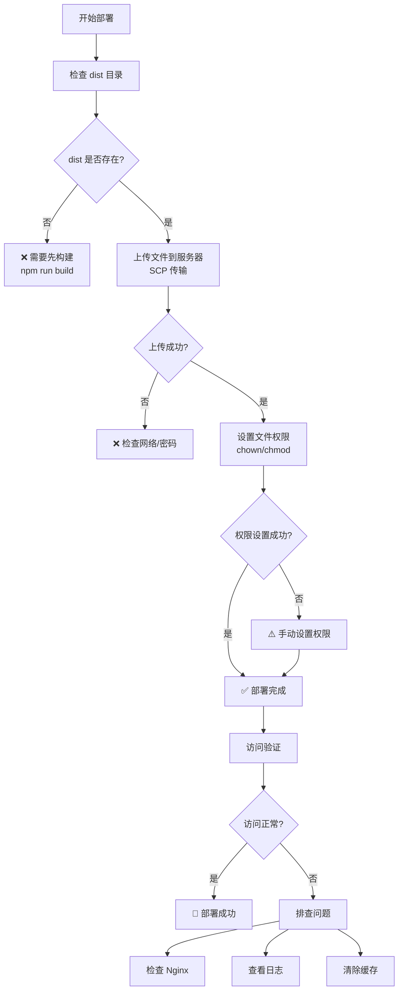

# 🚀 际华协同办公管理平台 v2.0.0 部署流程

## 📊 部署流程图



## 🔄 部署时间线

### 阶段 1: 准备（已完成 ✅）
- ✅ 代码开发完成
- ✅ 版本号更新到 2.0.0
- ✅ 文档更新完成
- ✅ 本地构建成功
- ✅ 本地预览正常

### 阶段 2: 部署（进行中 🔄）
- ✅ 检查 dist 目录
- 🔄 上传文件到服务器
- ⏳ 设置文件权限
- ⏳ 验证部署成功

### 阶段 3: 验证（待进行 ⏳）
- ⏳ 访问生产环境
- ⏳ 测试核心功能
- ⏳ 检查性能指标
- ⏳ 收集反馈

### 阶段 4: 完成（待确认 ⏳）
- ⏳ 部署完成确认
- ⏳ 通知相关人员
- ⏳ 归档部署文档

---

## 📝 部署命令详解

### 1. 构建命令
```bash
npm run build
```
**作用**: 
- 编译 TypeScript 代码
- 打包优化 JS/CSS
- 生成生产环境文件

**输出**: `dist/` 目录

### 2. 上传命令
```bash
scp -r dist\* root@152.136.183.181:/var/www/jihua/
```
**作用**:
- 递归复制所有文件
- 从本地 dist 目录
- 到服务器 /var/www/jihua/

**要求**:
- SSH 密钥或密码
- 网络连接正常
- 服务器路径存在

### 3. 权限命令
```bash
ssh root@152.136.183.181 "chown -R nginx:nginx /var/www/jihua && chmod -R 755 /var/www/jihua"
```
**作用**:
- 设置文件所有者为 nginx
- 设置目录权限为 755
- 确保 Nginx 可以读取

### 4. 验证命令
```bash
ssh root@152.136.183.181 "ls -la /var/www/jihua/"
```
**作用**:
- 列出服务器文件
- 验证文件已上传
- 检查权限设置

---

## 🎯 部署检查点

### ✅ 部署前检查
- [x] 代码已提交
- [x] 版本号已更新
- [x] 文档已更新
- [x] 本地测试通过
- [x] 构建无错误

### 🔄 部署中检查
- [x] dist 目录存在
- [x] 服务器可连接
- [ ] 文件上传成功
- [ ] 权限设置成功

### ⏳ 部署后检查
- [ ] 网站可访问
- [ ] 登录功能正常
- [ ] 核心功能正常
- [ ] 性能达标
- [ ] 无明显错误

---

## 🛠️ 故障处理流程

### 场景 1: 上传失败
```
问题: scp 命令失败
原因: 网络/密码/路径

解决:
1. 检查网络连接
2. 验证 SSH 密码
3. 测试手动登录
4. 检查服务器路径
```

### 场景 2: 权限失败
```
问题: chown/chmod 失败
原因: 权限不足/路径错误

解决:
1. 使用 root 账户
2. 检查路径存在
3. 手动执行命令
4. 验证文件所有者
```

### 场景 3: 访问失败
```
问题: 无法访问网站
原因: Nginx/缓存/防火墙

解决:
1. 检查 Nginx 状态
2. 重启 Nginx 服务
3. 清除浏览器缓存
4. 检查防火墙规则
```

### 场景 4: 功能异常
```
问题: 部分功能不工作
原因: API/配置/浏览器

解决:
1. F12 查看控制台
2. 检查 Network 请求
3. 验证 CloudBase 配置
4. 对比本地版本
```

---

## 📊 部署监控

### 实时监控
```bash
# 服务器 CPU/内存
ssh root@152.136.183.181 "top -bn1 | head -20"

# Nginx 访问日志
ssh root@152.136.183.181 "tail -f /var/log/nginx/access.log"

# Nginx 错误日志
ssh root@152.136.183.181 "tail -f /var/log/nginx/error.log"

# 文件大小
ssh root@152.136.183.181 "du -sh /var/www/jihua"
```

### 性能测试
```bash
# 响应时间测试
curl -w "@curl-format.txt" -o /dev/null -s http://jihuadz.xin

# 并发测试（可选）
ab -n 100 -c 10 http://jihuadz.xin/
```

---

## 🔐 安全检查

### 部署安全
- [x] 使用 SSH 密钥（推荐）
- [ ] 禁用 root 直接登录（可选）
- [x] 设置正确的文件权限
- [ ] 启用 HTTPS（推荐）

### 应用安全
- [ ] 修改默认密码
- [ ] 配置安全域名
- [ ] 启用 CORS 限制
- [ ] 定期备份数据

---

## 📞 联系方式

### 技术支持
- **部署问题**: 查看本文档
- **功能问题**: 查看 RELEASE_NOTES
- **紧急问题**: 立即回滚

### 相关文档
- [部署检查清单.md](./部署检查清单.md)
- [快速部署v2.0.0.md](./快速部署v2.0.0.md)
- [RELEASE_NOTES_v2.0.0.md](./RELEASE_NOTES_v2.0.0.md)

---

## 📈 版本历史

| 版本 | 日期 | 说明 |
|------|------|------|
| 2.0.0 | 2025-12-14 | 主体功能完成 |
| 1.2.0 | 2025-12-11 | 任务管理更新 |
| 1.1.4 | 2025-12-10 | 权限系统优化 |

---

**Built with ❤️ for 际华集团**  
*际华协同办公管理平台 v2.0.0 - 2025年12月14日*
